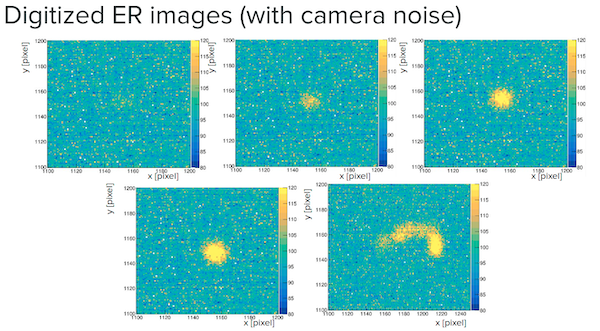
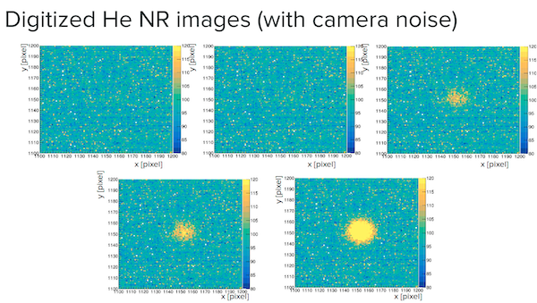

# IDAO-2021-darkmatter-id

This repository is the solution for the Online Round of [IDAO-2021](https://idao.world/) ML-contest of team **Alpha Analysts**.

Baseline solution can be found [here](https://github.com/abdalazizrashid/idao-21-baseline) and data from contest's organizers can be found [here](https://disk.yandex.ru/d/IC_vZbCcsEt03g).

The optimized metric is ROC AUC - MAE, where ROC AUC - is quality metric for particles classification, MAE - is quality metric for particles energy .

**NOTE:** Final score on leaderborder is calculated as `100 * (ROC AUC - MAE)`.

## Problem statement

The objective is to create a model that, given an event, outputs the energy of the particle.
In the data there are electrons, He nucleus and energies in the range 1, 3, 6, 10, 20, 30 keV - 12 classes in total. These classes are split into training classes and test classes, with 3, 10, 30 keV electrons and 1, 6, 20 keV He being training classes and the remaining six being the test classes.

| Energy, kEv | He | e |
|-------------|----|---|
| 1           | +  | - |
| 3           | -  | + |
| 6           | +  | - |
| 10          | -  | + |
| 20          | +  | - |
| 30          | -  | + |

where `+` - class in train, `-` - class in test.

Test part also has a small public part, which consists of images taken from train distribution.

Full statement can be found in [this video](https://www.youtube.com/watch?v=VzH_58yYz5k).

## Track 1

Unlike baseline solution we are going to solve classification tasks both for particle type and it's energy.

All input images are preprocessed as follows:
1. find the particle's position (basic image recognition techniques are used, e.g. image binarization and morphological transforms);
2. image is moved so the particle is centered and then cropped till 120px x 120px;
3. noise is removed from the image applying median filter.

Our solution is based on neural networks, which usually need a lot of data to provide significant quality. The contest's dataset is rather small, so we used augmentation techniques to enrlarge number of images used for trainig: horziontal and vertical flips, rotations on 90 and 180 degrees.

Our solution consists of 3 parts.

[`Track1-CNN.ipynb`](Track1-CNN.ipynb) is siamese convolutional network trained only on train data. The neural network has two classification heads: one for particle's type, another for particle's energy. The classfier is fitted on 5-folds (so we have 5 different models). This model is expected to be overfitted on train data. We suppose it gives very good quality for public part of test data and poor on private one. This classifier will be called ***basic classifier***.

[`Track1-VAE-labeling.ipynb`](Track1-VAE-labeling.ipynb) is variational autoencoder trained on all available data. The quality of VAE model can be seen on the image below.

The hidden states of VAE for all images (from train and test) are passed to t-SNE for dimension reduction and visualisation. The t-SNE embeddings are clustered by k-means. As you can see on the image below the clustersiation is rather good, so images from all 12 classes can be correctly determined.

To define which cluster contains points from one of the 12 classes, the following factors are taken into account:
* classes distribution in train and test data;
* mutual positions of clusters;
* predictions of basic classifier.

| Energy, kEv | He | e |
|-------------|----|---|
| 1           | 4  | 7 |
| 3           | 11 | 0 |
| 6           | 1  | 9 |
| 10          | 8  | 2 |
| 20          | 5  | 6 |
| 30          | 10 | 3 |

Now points from test data also can be used for training. According to clusterisation clusters 7 and 11 are not well seperated, so we take less points from these clusters for training.

[`Track1-CNN-labeled.ipynb`](Track1-CNN-labeled.ipynb) is basic classfier on train data and labled data from test.

## Track 2

The solution for this track takes only 4 final models from solution for track 1.

[`Track2`](Track2) contains python code for submission.

## Other ideas

Our models try to solve 2 seperate problems: classify particle's type, predict particle's energy.
It turns out that better quality can be faster achived by solving these 2 problems simultaneously - predict one of 12 classes.
The problem is that we need scores for particle's type classification, so we still have to train 2 heads.

Example solution can be found [here](extra/Track1-CNN-labeled-2.ipynb). 

## Leaderboard

|             | auc (public) | mae (public) | score (public) | auc (private) | mae (private) | score (private) |
|-------------|--------------|--------------|----------------|---------------|---------------|-----------------|
| **Track 1** | 0.999996     | 0.025965     | 974.03         | 0.977366      | 0.173529      | 964.00          |
| **Track 2** | 1.000000     | 0.036000     | 803.84         | 0.945614      | 0.472565      | 473.05          |

Our team took the 4th place on the private leaderboard according to both tracks.
